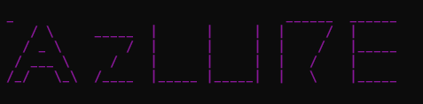
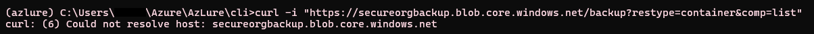
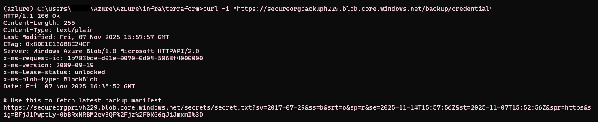
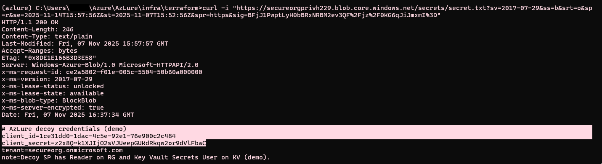

# AzLure — Azure Honeypot (IaC + CLI)


AzLure is a **cost‑aware Azure honeypot** you can auto‑deploy into your own tenant.
It ships with a **CLI** and **Terraform**. Two modes:

- **Automatic**: one‑command deploy with realistic defaults (public container, SAS chain to private blob with decoy creds, Key Vault, Automation Account).
- **Manual**: you choose tenant / names; the CLI passes the values into Terraform & the seeder.

> ⚠️ **Safety**: This project is for defensive research and training. Use in a **dedicated subscription**. All credentials are **decoys**. 

## What’s deployed (Automatic mode)
- **Public Storage A**: container `backup` (public, listable). A blob `credential` contains a **SAS URL**.
- **Private Storage B**: container `secrets` (private). Blob `secret.txt` holds **decoy App Registration creds** (client_id + client_secret).
- **App Registration (SP)**: scoped **Reader** over the honeypot RG and **Key Vault Secrets User** on the Key Vault.
- **Key Vault**: holds decoy secrets (e.g., `id_rsa`).
- **Automation Account**: named **Automatic Backup**; the decoy SP has **Automation Contributor** on it (demo of lateral privileges).

## Example Output (Usage)
- Insecure Blob Storage

Before:
Public container does not exist.


After:
There is a public blob which reveals SAS URL.


SAS URL grants access which reveals decoy credentials in the form of "client_id" and "secret".


### Prereqs
- Terraform ≥ 1.5
- Azure CLI (`az`) login to a dedicated subscription
- Python 3.10+ (`pip install -r seeder/requirements.txt`)
- (Optional) `make`

### 1) Automatic deployment
```bash
cd azlure
python cli/azlure.py auto --yes

### 2) Manual deployment
```bash
cd azlure
python cli/azlure.py manual --yes

### 3) Remove deployment
```bash
cd azlure
python cli\azlure.py destroy --yes
